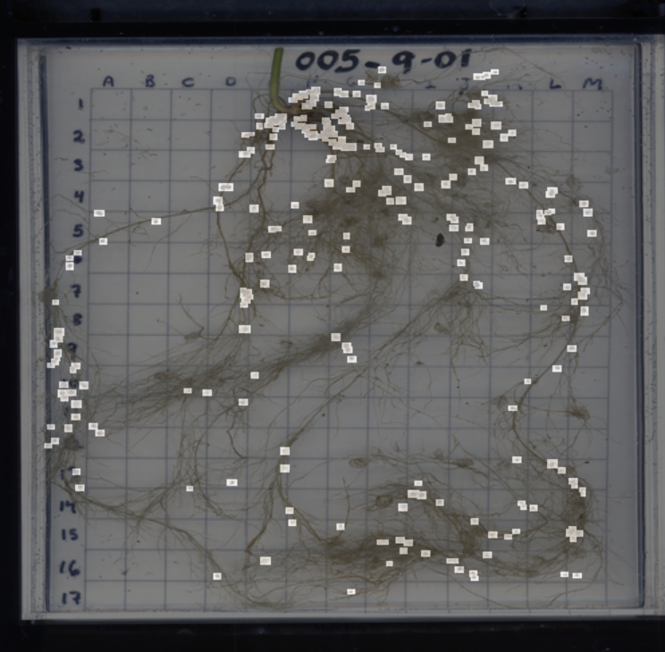
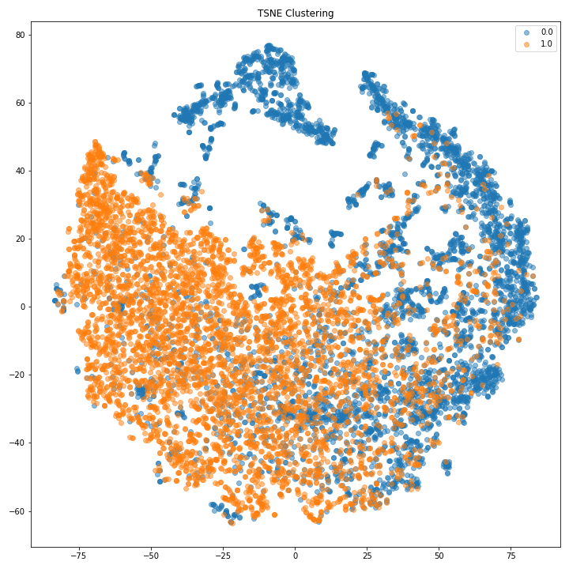
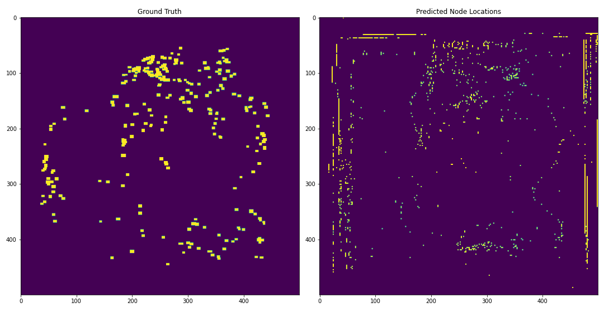
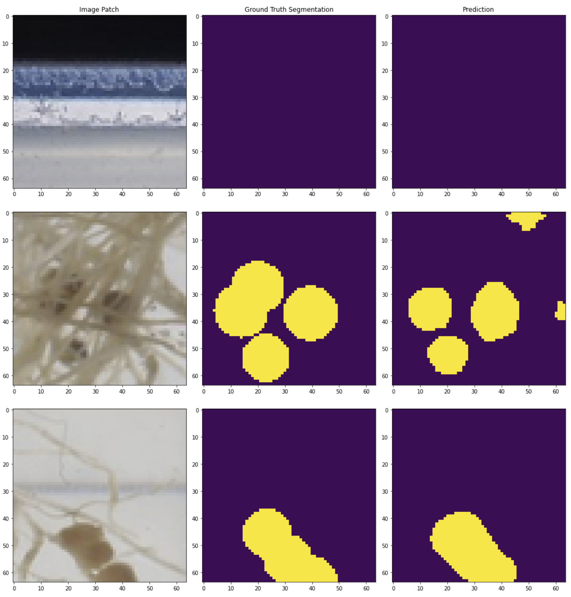
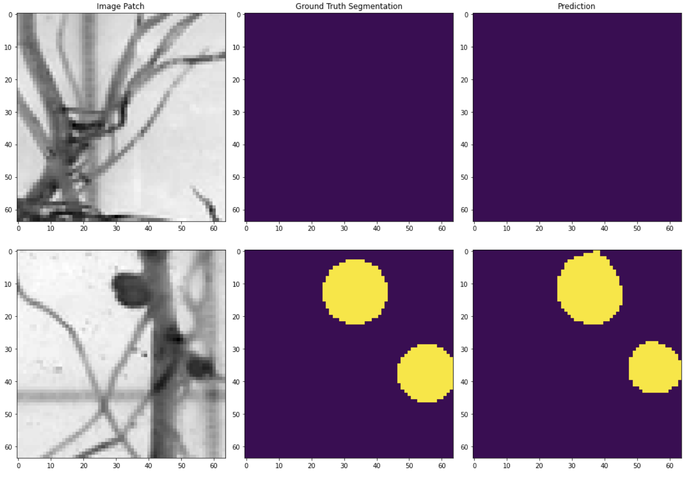

# Automated Root Nodule Detection

Machine Learning algorithms have been pushing massive advancements in automating many repetitive procedures. Applications of this technology would be especially useful in agricultural settings where farmers have to manage thousands of crops over acres of lands. Computer Vision techniques offer tools to make this possible to monitor plant health at large scale and we will be exploring detection of plant root nodules. Root nodules are small lumps found along the length of a root where nitrogen-fixing bacteria like Rhizobium reside inside the membrane. This bacteria forms a symbiotic relationship with the plant by converting atmospheric nitrogen to ammonium that the plants can then use for their development. The number and quality of nodules can be an indicator of plant health and so having automated detection would be a powerful tool. In this research we will explore the use of different learning algorithms to detect root nodules and explore the benefits and pitfalls of the techniques. 

### Dataset
The data provided included ten unique 12 megapixel images along with bounding boxes to indicate the location of different
nodules. Our goal is to build a model that can detect these nodules given the limited dataset.

### Dimensionality 
We wanted to visualize image patches that included nodules vs those that didn't in 
a low dimensional space. To do so, we plot TSNE embeddings of the patches and can 
clearly discern two groups. The difficult task for our different classification
models will be to discern between fine color differences, as we see patches that are 
nodules vs roots overlap in embedddings.

### Binary Patch Prediction Approach
Although we had strong predictive capabilities of determining if an image patch included a nodule, the final
segmentation performance was not dependable. Based on RGB color features alone it did not seem possible to extract 
exact locations of nodules without also including parts of the roots and borders of the image.

### UNet Approach
The UNet model allowed for the most consistent approach to even detect nodules almost fully occluded by roots. This 
method resulted in a score of about 68% mIoU.

### Importance of Spatial Features
Our hypothesized reason for the success of the UNet is that identifying nodules was more based on the structural 
features of a nodule rather than their color. To  put this to  the test we retrained our UNet to only accept
grayscale images for training and got a slight improvement to a 69.7% mIoU.

